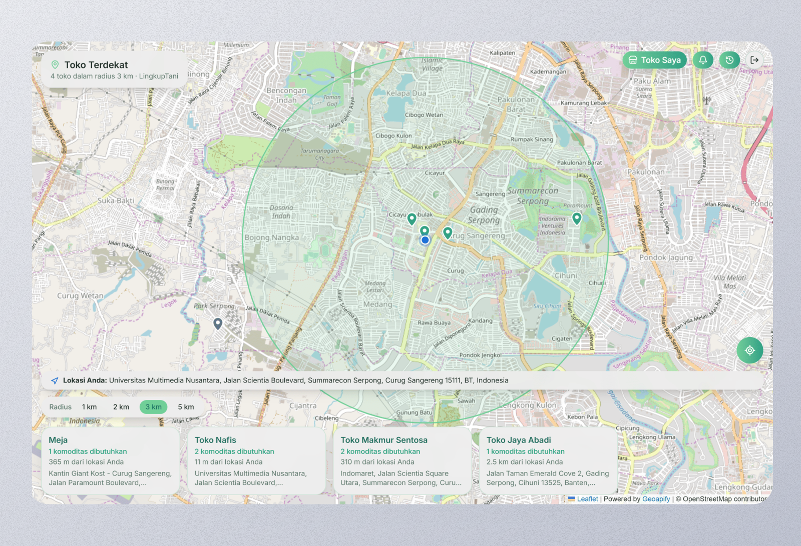
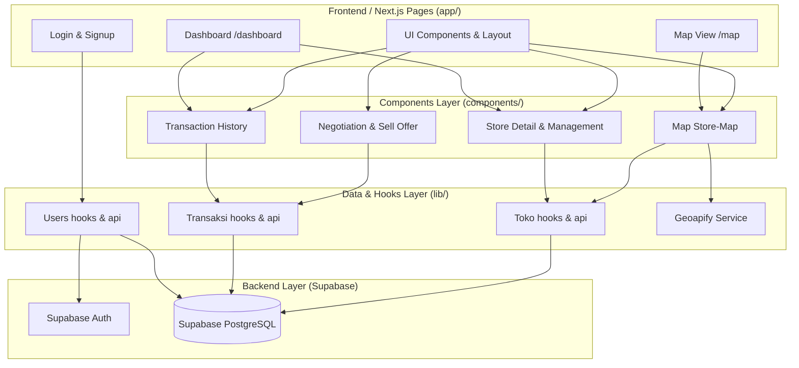

# LingkupTani 🌾

<!-- BADGES -->
<div align="left">
  
  
  
  
  
  
</div>

> A mobile-first, map-centric platform designed for farmers to find local buyers, view real-time market demand, and negotiate optimal prices directly within their nearby community.

---

## 🖥️ Preview



---

## 💡 Overview

**LingkupTani** was built during the **Garuda Hacks 7.0** hackathon to solve a critical issue in Indonesia's agricultural supply chain: the gap between local farmers and immediate buyers. 

In early 2023, a farmer in West Lampung went viral for dumping hundreds of kilograms of ripe tomatoes into a ravine because prices crashed to Rp600–800/kg (where the crate cost more than the tomatoes themselves). In Indonesia, fruits and vegetables represent the highest amount of food lost and wasted, with 14% lost post-harvest and 17% wasted at-the-table—amounting to approximately **Rp550 trillion annually** (4-5% of GDP). 

This is fundamentally a connection issue. Farmers are often blind to local demand, and their produce wilts while waiting to find buyers. LingkupTani closes this gap by showing farmers stores and buyers within a **1–3 km radius** that need their produce immediately, ensuring quick local transactions for fresh goods.

---

## ✨ Key Features

*   **📍 Interactive Store Map**: Search and view nearby buyers within a customizable radius using an interactive map built with Leaflet and OpenStreetMap tiles.
*   **📊 Store Demands Insight**: View real-time demands requested by nearby stores so farmers know exactly what to harvest and sell.
*   **💬 Negotiation Offer**: Negotiate prices directly in the app to secure fairer profit margins and prevent middlemen exploitation.
*   **⏳ Transaction History**: Track pending, approved, and completed sales transparently.
*   **👤 Unified Account System**: A single account architecture that allows users to act as a buyer, farmer, or store owner without needing separate logins.
*   **🌐 Low-Literacy Friendly Registration**: Incorporates the Geolocation API and Geoapify reverse-geocoding to auto-fill address details on sign-up, ensuring the app is accessible to all.

---

## 🛠️ System Architecture

The application uses Next.js with App Router, custom Supabase hooks for state synchronization, and a map-centric frontend.



### Complex Technical Challenges Resolved:
1. **Low-Literacy Geolocation Auto-complete**: Simplifies address filling by combining the HTML5 Geolocation API with Geoapify to lookup and auto-insert detailed street names.
2. **Unified Account Role Architecture**: Instead of maintaining separate accounts for buyers and farmers, the database tracks optional store registrations. The interface dynamically adjusts functionalities based on active context.
3. **Mobile-First Responsive Map Container**: Integrates Leaflet and OpenStreetMap containers inside Tailwind classes to prevent layout breaks on small screens and poor mobile connections.

---

## 📦 Tech Stack

| Category | Technology | Purpose |
| :--- | :--- | :--- |
| **Core Framework** | Next.js v16.2.10, React 19 | Frontend layout, Server Components, and SSR hydration. |
| **Database & Auth** | Supabase (PostgreSQL + GoTrue) | Single source of truth for transactions, store catalogs, and authentication. |
| **Map & Geocoding** | Leaflet, React Leaflet v5, Geoapify | Interactive map layers, custom store markers, and reverse-geocoding. |
| **State & Fetching** | React Query (TanStack Query) v5 | Robust client caching, synchronization, and optimistic UI updates. |
| **Styling & UI** | Tailwind CSS v4, Radix UI, shadcn/ui | Beautiful, accessible, mobile-first design system. |
| **CI/CD & Hosting** | Docker, GitHub Actions | Automated deployment to a VPS. |

---

## 🚀 Getting Started

### Prerequisites

Ensure you have the following installed on your machine:
*   **Node.js** (v18 or higher)
*   **Supabase Project** (For backend auth and database tables)
*   **Geoapify API Key** (For reverse geocoding addresses)

### 1. Installation

Clone the repository and install the dependencies:
```bash
# Clone the repository
git clone https://github.com/NafisHandoko/lingkuptani.git
cd lingkuptani

# Install dependencies
npm install
```

### 2. Set Up Environment Variables

Create a `.env` or `.env.local` file in the root directory and add the following keys:
```env
NEXT_PUBLIC_SUPABASE_URL=your_supabase_url
NEXT_PUBLIC_SUPABASE_ANON_KEY=your_supabase_anon_key
NEXT_PUBLIC_GEOAPIFY_API_KEY=your_geoapify_api_key
```

### 3. Development

Run the hot-reloading development server locally:
```bash
npm run dev
```

### 4. Build

Build the project for production:
```bash
npm run build
```

---

## 📁 Project Structure

Below is the layout of the project, showing key features and directories:

```text
lingkuptani/
├── app/                  # Next.js App Router
│   ├── api/              # API routes
│   ├── dashboard/        # Farmer/buyer dashboards and history
│   ├── error/            # Error fallback pages
│   ├── login/            # Login page
│   ├── signup/           # Signup page (with geolocation autocomplete)
│   ├── map/              # Map-first search interface
│   ├── globals.css       # Tailwind & custom CSS styles
│   ├── layout.tsx        # Main application layout
│   └── providers.tsx     # React Query and Leaflet provider wrappers
├── components/           # UI Components
│   ├── ui/               # Reusable primitive UI components (shadcn/ui)
│   ├── map/              # Leaflet Map components (e.g., store-map.tsx)
│   ├── sell/             # Selling & negotiating forms/drawers
│   ├── toko/             # Store detail & management cards
│   ├── history/          # Transaction history logs
│   └── confirmation/     # Confirmation popups/dialogs
├── lib/                  # Business Logic & Integrations
│   ├── supabase/         # Supabase Client, Server, and Middleware config
│   ├── toko/             # Toko/Store custom API hooks and services
│   ├── transaksi/        # Transaction/Order management API and hooks
│   ├── users/            # User account management API and hooks
│   └── geoapify.ts       # Reverse geocoding & address integration
├── public/               # Static assets & icons
└── README.md             # Project documentation (this file)
```

---

## 📝 License

Distributed under the MIT License. See `LICENSE` for more information.